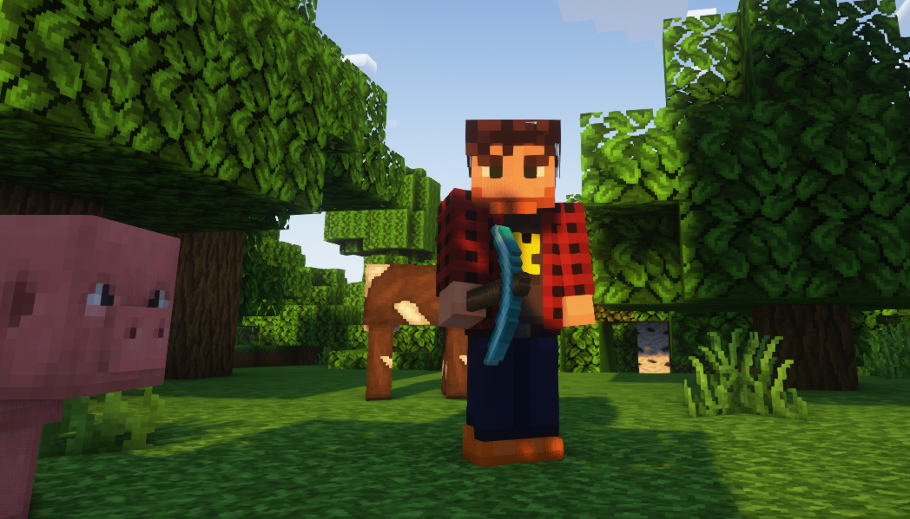

# Minecraft Mod Development

Hello there, fellow Minecraft enthusiast!

## 📖 Introduction

I'm Markus Bordihn, the developer behind several Minecraft mods.
I'm writing this document to address some of the most frequently asked questions.

Minecraft Mods are a passion project that I work on during my limited free time, alongside my
day-to-day job and spending time with my kids and family.
I'm a one-person team, so I have to be selective about the features I implement and the mods I could
support.

While developing and enhancing the mods, I've had the privilege of receiving valuable assistance
from my family. They've played a crucial role in contributing design ideas, testing the mods, and
providing insightful feedback. It's truly a collaborative effort, and I deeply appreciate their
involvement in shaping the overall experience.

However, it's important to note that the majority of the work on the codebase and the
conceptualization of the mods falls under my responsibility. I take the lead in crafting the
technical aspects and overarching concepts to ensure the mods meet a certain standard.

Together, as a team, we strive to bring you the best possible Minecraft modding experience.
Your support and feedback, whether it's from family or the wider community, fuel our passion for
creating innovative and enjoyable content. Thank you for being part of this journey!

## 📚 Supported Minecraft Versions

In the ever-evolving world of Minecraft, I strive to provide the best experience for players across
various versions.
Here's an overview of the supported statuses for different Minecraft versions, based on download
statistics for my mods.

This serves as a guideline for future development:

| Minecraft Version | Status            |
|-------------------|-------------------|
| < 1.18.2          | ❌ Not supported   |
| **1.18.2**        | ✔️ Supported      |
| 1.19              | ⚠️ Bug Fixes only |
| 1.19.1            | ⚠️ Bug Fixes only |
| **1.19.2**        | ✔️ Supported      |
| 1.19.3            | 🚩 Deprecated     |
| 1.19.4            | 🚩 Deprecated     |
| 1.20              | 🚩 Deprecated     |
| **1.20.1**        | ✔️ Supported      |
| 1.20.2            | 🧪 Experimental   |
| 1.20.3            | 🚩 Deprecated     |
| 1.20.4            | 🧪 Experimental   |

**Legend:**

- ✔️ Supported: Full support for both bug fixes and new features.
- ⚠️ Bug Fixes only: Critical bug fixes will be addressed, but new features will not be added.
- 🚩 Deprecated: No active support; consider updating to a more recent version.
- 🧪 Experimental: Testing new features and improvements; use with caution.
- ❌ Not supported: No support for this version.

Please note that critical bug fixes may be backported to older versions, but the introduction of new
features will be exclusive to the latest Minecraft version.

## 🔄 Mod Loader Support - Forge, NeoForge, and Fabric

### Forge

I initially started with Forge and has been primarily developed for this mod loader.
Most of the features and optimizations are tailored for the Forge environment.

### Fabric

Recently, I've begun supporting Fabric as well. However, please note that transitioning from Forge
to Fabric takes time, especially for more complex mods.
I'm working hard to bring some mods to the same level of functionality on Fabric, but this process
requires careful adaptation and testing.

### NeoForge

NeoForge is a new mod loader, and I'm still getting acquainted with its structure.
Support for NeoForge will be considered on a case-by-case basis due to fundamental changes that may
require additional time and effort to port from Forge.

In general, supporting additional mod loaders is a time-consuming process. However, the source
code (excluding assets) is open source.
If any modder in the community is interested, they can create a fork for Fabric or other loaders.

## 🤔 Frequently Asked Questions

### Why Can't I Implement All Feature Requests?

First and foremost, I appreciate your enthusiasm and ideas for new features.
It warms my heart to see such an engaged community!
However, I want to be transparent about the limitations I face. As much as I'd love to fulfill every
feature request, it's simply not feasible due to these time constraints.

I prioritize quality over quantity, and ensuring that each feature meets a certain standard takes
time and careful consideration.
So, while I may not be able to implement every request, please know that I value your input and will
do my best to enhance the mod within my capacity.

### Why Do You Only Support the Latest Minecraft Version?

Minecraft is a dynamic game that evolves with each update. Supporting multiple versions can be
challenging and time-consuming.
Focusing on the latest version allows me to take advantage of new features, optimizations, and bug
fixes provided by Mojang.
It ensures a more stable and enjoyable experience for all users.

While I understand that some players may prefer older versions for various reasons, concentrating on
the latest release allows me to allocate my limited resources more efficiently.

### Can You Add Support for Mods X and Y?

I appreciate the interest in compatibility with other mods like X and Y. However, integrating with
specific mods requires thorough testing and collaboration with their developers.
As an independent modder with time constraints, I may not be able to support every mod out there.

If you have a particular mod in mind, consider reaching out to its developer and suggesting a
collaboration.
I'm always open to working together with other mod creators to enhance the overall Minecraft
experience.

### Why do you need a debug.log or error.log, can't you just fix the issue?

Understanding the context of an issue is crucial for effective problem-solving. Debug and error logs
provide essential information about what might be causing a problem. While I strive to address
issues promptly, having access to these logs significantly speeds up the debugging process and helps
ensure accurate solutions.

### Why is there no Discord server?

At the moment, I don't have a Discord server. To streamline communication and better manage feature
requests, bug reports, and discussions, I encourage users to use the corresponding GitHub page. This
allows for a more organized and centralized platform for community interaction and support.

### Why don't you answer private messages (PMs)?

Unfortunately, due to time constraints, I may not be able to respond to all private messages across
various platforms. For a more efficient and community-oriented support experience, it's recommended
to utilize the GitHub page for discussions, bug reports, and feature requests.

### Can I showcase your mods in my video?

Absolutely! I appreciate your interest in showcasing my mods. Feel free to create videos and share
your experiences with the community. It's a great way to spread the word and contribute to the mod's
visibility.

### Can I use your mod in a mod pack?

Yes, you are welcome to include my mod in your mod pack! However, to ensure that users receive
timely updates and bug fixes, please avoid hard copying the mod files into the mod pack. Instead,
use CurseForge to reference to the original download source. This helps maintain the integrity of
the mod and ensures users always have access to the latest version.

## 💙 How Can I Support Your Work?

Your support means the world to me! If you'd like to contribute, consider spreading the word my
mods, sharing your experiences on social media, or leaving a positive review.
Your enthusiasm keeps the project alive and motivates me to continue improving and expanding the
mod.

Thank you for your understanding and continued support. Happy crafting!

- Kaworru
